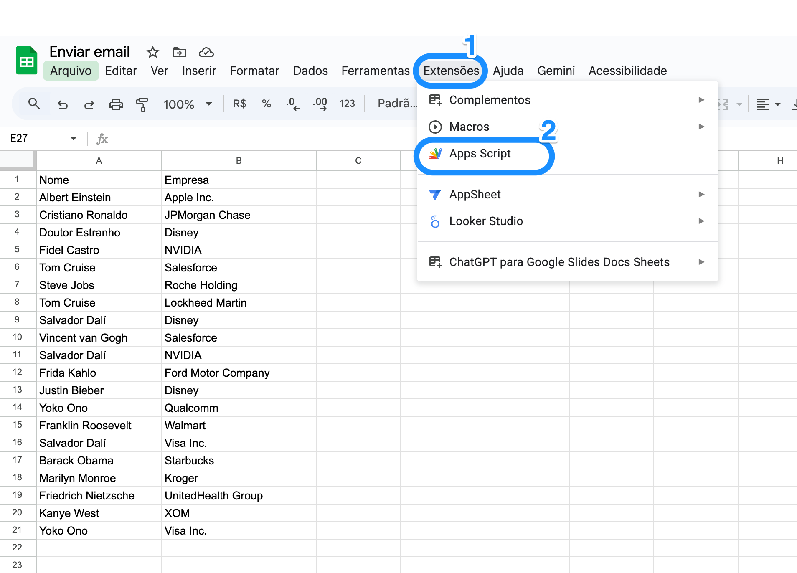
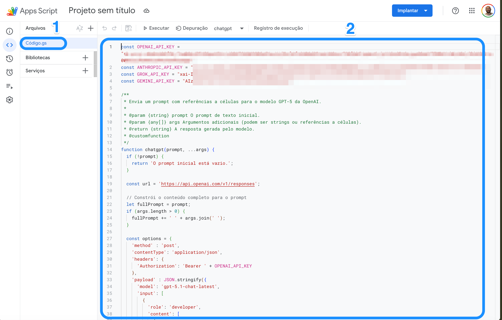

# LLM Functions for Google Sheets

Integre os principais modelos de IA diretamente no Google Sheets usando fórmulas simples.

[](https://opensource.org/licenses/MIT)
[](https://developers.google.com/apps-script)

---

## Sumário

- [Sobre o Projeto](#sobre-o-projeto)
- [Modelos Suportados](#modelos-suportados)
- [Instalação](#instalação)
- [Configuração das API Keys](#configuração-das-api-keys)
- [Funções Disponíveis](#funções-disponíveis)
- [Exemplos de Uso](#exemplos-de-uso)
- [Casos de Uso por Área](#casos-de-uso-por-área)
- [Boas Práticas](#boas-práticas)
- [Troubleshooting](#troubleshooting)
- [Contribuindo](#contribuindo)
- [Licença](#licença)

---

## Sobre o Projeto

Este projeto permite usar os principais Large Language Models (LLMs) diretamente como fórmulas no Google Sheets, eliminando a necessidade de copiar e colar dados entre planilhas e interfaces de chat.


**Benefícios:**
- Processe centenas de linhas em segundos
- Escolha o modelo ideal para cada tarefa
- Use suas próprias API keys (controle total de custos)
- Zero dependências externas além do Google Apps Script

---

## Modelos Suportados

| Modelo | Função | Provider | Características |
|--------|--------|----------|-----------------|
| GPT-5.1 | `chatgpt()` | OpenAI | Raciocínio avançado, web search |
| Claude Sonnet 4.5 | `claude()` | Anthropic | Análise complexa, contexto longo |
| Grok 4.1 | `grok()` | x.ai | Alta velocidade, custo-benefício |
| Gemini 3 Pro | `geminy()` | Google | Integração nativa Google |

---

## Instalação

### Passo 1: Abrir o Editor de Scripts

1. Abra sua planilha no Google Sheets
2. Vá em **Extensões** → **Apps Script**



### Passo 2: Adicionar o Código

1. No editor que abrir, delete qualquer código existente
2. Copie e cole o conteúdo do arquivo `code.gs` deste repositório
3. Clique em **Salvar** (ícone de disquete ou Ctrl+S)



### Passo 3: Autorizar

1. Na primeira execução, o Google pedirá autorização
2. Clique em **Revisar permissões**
3. Selecione sua conta Google
4. Clique em **Avançado** → **Ir para [nome do projeto]**
5. Clique em **Permitir**

---

## Configuração das API Keys

Edite as primeiras linhas do código com suas chaves de API:

```javascript
const OPENAI_API_KEY = "sk-proj-sua-chave-aqui";
const ANTHROPIC_API_KEY = "sk-ant-sua-chave-aqui";
const GROK_API_KEY = "xai-sua-chave-aqui";
const GEMINI_API_KEY = "AIza-sua-chave-aqui";
```

### Onde obter as API Keys:

| Provider | Link | Tier Gratuito |
|----------|------|---------------|
| OpenAI | [platform.openai.com/api-keys](https://platform.openai.com/api-keys) | $5 créditos iniciais |
| Anthropic | [console.anthropic.com](https://console.anthropic.com) | $5 créditos iniciais |
| x.ai | [console.x.ai](https://console.x.ai) | Créditos mensais gratuitos |
| Google | [aistudio.google.com](https://aistudio.google.com/apikey) | Gratuito com limites |

> ⚠️ **Importante:** Nunca compartilhe suas API keys. Se o código for colaborativo, considere usar o [Properties Service](https://developers.google.com/apps-script/reference/properties) do Google Apps Script.

---

## Funções Disponíveis

### `chatgpt(prompt, ...args)`

Envia um prompt para o modelo GPT-5.1 da OpenAI.

```javascript
=chatgpt("Seu prompt aqui", A2, B2, C2)
```

**Parâmetros:**
- `prompt` (obrigatório): Texto do comando/pergunta
- `args` (opcional): Células ou valores adicionais concatenados ao prompt

**Retorno:** Texto gerado pelo modelo

---

### `claude(prompt, ...args)`

Envia um prompt para o modelo Claude Sonnet 4.5 da Anthropic.

```javascript
=claude("Seu prompt aqui", A2, B2)
```

**Parâmetros:**
- `prompt` (obrigatório): Texto do comando/pergunta
- `args` (opcional): Células ou valores adicionais concatenados ao prompt

**Retorno:** Texto gerado pelo modelo

**Características:** Suporta até 64.000 tokens de saída.

---

### `grok(prompt, ...args)`

Envia um prompt para o modelo Grok 4.1 da x.ai.

```javascript
=grok("Seu prompt aqui", A2)
```

**Parâmetros:**
- `prompt` (obrigatório): Texto do comando/pergunta
- `args` (opcional): Células ou valores adicionais concatenados ao prompt

**Retorno:** Texto gerado pelo modelo

**Características:** Modelo não-raciocínio otimizado para velocidade (temperatura 0.7).

---

### `geminy(prompt, ...args)`

Envia um prompt para o modelo Gemini 3 Pro do Google.

```javascript
=geminy("Seu prompt aqui", A2, B2, C2)
```

**Parâmetros:**
- `prompt` (obrigatório): Texto do comando/pergunta
- `args` (opcional): Células ou valores adicionais concatenados ao prompt

**Retorno:** Texto gerado pelo modelo

**Características:** Até 8.192 tokens de saída, temperatura 0.7.

---

## Exemplos de Uso

### Exemplo Básico

```
=claude("Traduza para inglês:", A2)
```

### Com Múltiplas Células

```
=chatgpt("Escreva um email de follow-up para", A2, "da empresa", B2, "sobre o tema", C2)
```

### Análise de Sentimento

```
=grok("Classifique o sentimento como positivo, negativo ou neutro:", D2)
```

### Categorização

```
=geminy("Qual o setor desta empresa? Responda apenas o nome do setor:", A2)
```

### Resumo de Texto

```
=claude("Resuma em 3 bullet points:", E2)
```

---

## Casos de Uso por Área

### Operações e Dados

| Caso de Uso | Fórmula Exemplo |
|-------------|-----------------|
| Padronização de nomes | `=grok("Padronize este nome de empresa:", A2)` |
| Categorização de leads | `=claude("Classifique este lead por setor:", A2)` |
| Limpeza de dados | `=chatgpt("Corrija erros de formatação:", A2)` |
| Deduplicação inteligente | `=geminy("Esta empresa é a mesma que", A2, "?", B2, "Responda sim ou não")` |

### Marketing e Conteúdo

| Caso de Uso | Fórmula Exemplo |
|-------------|-----------------|
| Criação de títulos | `=chatgpt("Crie 3 títulos para um artigo sobre:", A2)` |
| Resumo de artigos | `=claude("Resuma os pontos principais:", A2)` |
| Tradução | `=geminy("Traduza para espanhol:", A2)` |
| Análise de feedback | `=grok("Extraia os 3 principais pontos deste feedback:", A2)` |

### Vendas e CRM

| Caso de Uso | Fórmula Exemplo |
|-------------|-----------------|
| Pesquisa de empresas | `=claude("Faça um resumo sobre a empresa", A2, "e seus principais executivos")` |
| Qualificação de leads | `=chatgpt("Este lead tem fit com B2B SaaS? Dados:", A2, B2, C2)` |
| Geração de emails | `=grok("Escreva um email de prospecção para", A2, "da empresa", B2)` |
| Enriquecimento de dados | `=geminy("Qual o provável cargo de", A2, "baseado na empresa", B2)` |

### Análise e BI

| Caso de Uso | Fórmula Exemplo |
|-------------|-----------------|
| Interpretação de métricas | `=claude("Interprete esta variação de", A2, "para", B2, "em vendas")` |
| Geração de insights | `=chatgpt("Que insights podemos tirar destes dados:", A2:D2)` |
| Explicação de anomalias | `=grok("Por que este valor pode estar fora do padrão:", A2)` |

---

## Boas Práticas

### Prompts Eficientes

```
Ruim:  "Analise isso"
Bom:   "Analise o sentimento deste feedback e classifique como positivo, negativo ou neutro. Responda apenas com a classificação:"
```

### Otimização de Custos

1. **Use o modelo certo para a tarefa:** Grok para tarefas simples, Claude para análises complexas
2. **Seja específico:** Prompts claros geram respostas mais curtas e precisas
3. **Limite a saída:** Peça respostas em formatos concisos ("Responda em uma palavra", "Liste no máximo 3 itens")

### Segurança

- Não use dados pessoais sensíveis (CPF, dados financeiros, informações médicas)
- Não inclua senhas ou credenciais nos prompts
- Lembre-se: os dados são processados por servidores externos

### Verificação

- Sempre revise resultados antes de usar em decisões críticas
- IA pode "alucinar" — valide informações factuais
- Para dados numéricos, prefira funções nativas do Sheets

---

## Troubleshooting

### Erro: "O prompt inicial está vazio"

**Causa:** A célula referenciada está vazia ou a fórmula não tem prompt.

**Solução:** Verifique se há texto no primeiro parâmetro.

---

### Erro: "Erro na API: ..."

**Causas comuns:**
- API key inválida ou expirada
- Limite de requisições excedido
- Créditos esgotados

**Solução:** Verifique sua API key e saldo na console do provider.

---

### Erro: "Resposta inválida da API"

**Causa:** O modelo não retornou uma resposta no formato esperado.

**Solução:** Tente reformular o prompt ou usar outro modelo.

---

### Fórmula não executa / fica carregando

**Causas comuns:**
- Muitas requisições simultâneas
- Timeout da API

**Solução:** 
- Processe em lotes menores
- Aguarde alguns segundos entre execuções

---

### Como ver os logs de erro

1. No editor do Apps Script, vá em **Execuções**
2. Clique na execução com erro
3. Expanda para ver detalhes

---

## Contribuindo

Contribuições são bem-vindas! 

1. Faça um Fork do projeto
2. Crie uma branch para sua feature (`git checkout -b feature/NovaFuncao`)
3. Commit suas mudanças (`git commit -m 'Adiciona nova função'`)
4. Push para a branch (`git push origin feature/NovaFuncao`)
5. Abra um Pull Request

### Ideias para contribuição

- [ ] Suporte a novos modelos (Mistral, Llama, etc.)
- [ ] Cache de respostas para economizar API calls
- [ ] Função para processar ranges inteiros de uma vez
- [ ] Interface para configurar API keys sem editar código

---

## Licença

Distribuído sob a licença MIT. Veja `LICENSE` para mais informações.

---

## Gostou do projeto?

Deixe uma estrela! Isso ajuda outros desenvolvedores a encontrar o projeto.

---

**Desenvolvido por Guilherme Favaron**
